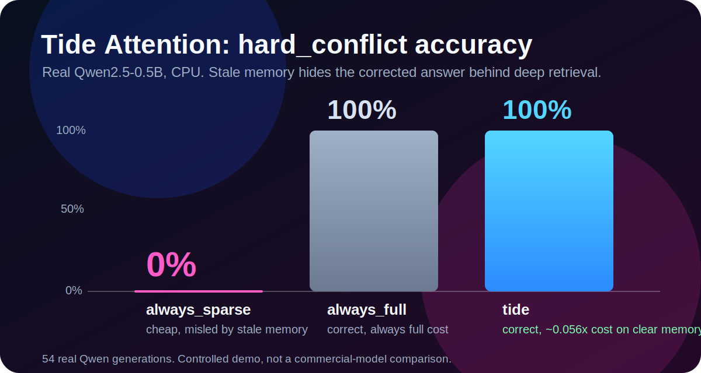

# Tide Attention v0.1-preview

**Clear memory stays cheap. Conflicting memory makes the model think harder.**

Tide Attention is a CPU-friendly proof-of-path for defect-gated long-context control. It is not a Transformer replacement. It demonstrates a different path: use defect signals from attention, phase interference, and memory contradictions to decide when a system can stay sparse and when it must switch to full/deep retrieval.

```text
clear memory      -> yang_sparse -> shallow retrieve -> low cost
conflicted memory -> yin_full    -> deep retrieve    -> conflict recovery
```

No NVIDIA GPU is required for the default demo. No model download. No API key.

> License: non-commercial use only. See [LICENSE](LICENSE).

## Headline result



On a real Qwen2.5-0.5B CPU run, a fixed sparse policy collapses exactly where memory conflicts hide the corrected answer. Tide detects the defect, switches to deep retrieval, and recovers, without paying that cost on clear memory.

| Policy | clear | conflict | hard_conflict | Cost on clear |
|---|---:|---:|---:|---:|
| `always_sparse` | 100% | 100% | **0%** | ~0.055x |
| `always_full` | 100% | 100% | 100% | ~1.00x |
| **`tide`** | 100% | 100% | **100%** | ~0.056x |

From `benchmarks/qwen_benchmark.py` (2 trials x 3 lengths x 3 cases x 3 policies = 54 real Qwen generations).

## 10-second demo

```bash
cd tide_attention
pip install -r requirements.txt
py -3 scripts/visual_demo.py
```

What you should see:

```text
Clear memory:
  mode = yang_sparse
  FLOPs = 0.191x full
  answer = PHOENIX

Conflict memory:
  mode = yin_full
  deep_retrieve = True
  answer = PHOENIX
```

For a real Qwen run on CPU:

```bash
py -3 scripts/qwen_needle_demo.py --quick --only clear --context-len 256 --device cpu
py -3 scripts/qwen_needle_demo.py --quick --only conflict --context-len 256 --device cpu
```

## Shareable one-liner

```text
Tide Attention is a defect-gated long-context controller: clear memory stays sparse, conflicting memory triggers full/deep retrieval.
```

## Why it is interesting

Most long-context systems face a trade-off:

| Mode | Strength | Weakness |
|---|---|---|
| full attention | robust | expensive |
| fixed sparse attention | cheap | can miss conflict / false memory |
| Tide Attention | sparse when clear, full/deep when contradicted | experimental controller, not a production kernel |

The core idea is to treat contradictions as **defects**. When memory is coherent, Tide stays on a condensate-sparse support. When memory contains mutually incompatible facts, Tide triggers the yin path: full attention plus deeper attractor retrieval.

## Proof-of-path claim

Tide Attention is designed to prove a conditional-computation path:

```text
Do not always think cheaply.
Do not always think expensively.
Think harder only when memory defects appear.
```

The results should be read as evidence for this controller path, not as a claim that Tide beats commercial models.

## Baseline comparison

The benchmark compares three policies on the same Qwen2.5-0.5B backbone:

| Policy | Behavior |
|---|---|
| `tide` | defect-gated switching: sparse on clear memory, deep/full on conflict |
| `always_sparse` | shallow retrieval and sparse-cost estimate for every case |
| `always_full` | deep retrieval and full-cost estimate for every case |

The `hard_conflict` case is the key test: the shallow/sparse path only sees stale "current value" memories, and the corrected `VALID_EVIDENCE` entry is reachable only through deep retrieval.

Run:

```bash
py -3 benchmarks/qwen_benchmark.py --trials 2 --lengths 512,1024,2048 --cases clear,conflict,hard_conflict --device cpu
```

Latest real Qwen2.5-0.5B CPU snapshot (54 generations):

| Policy | Split | n | Accuracy | Deep retrieve | Mean FLOPs vs full |
|---|---|---:|---:|---:|---:|
| `tide` | clear | 6 | 100% | 0% | 0.056x |
| `tide` | conflict | 6 | 100% | 100% | 1.006x |
| `tide` | hard_conflict | 6 | 100% | 100% | 1.006x |
| `always_sparse` | clear | 6 | 100% | 0% | 0.055x |
| `always_sparse` | conflict | 6 | 100% | 0% | 0.055x |
| `always_sparse` | hard_conflict | 6 | 0% | 0% | 0.055x |
| `always_full` | clear | 6 | 100% | 100% | 1.002x |
| `always_full` | conflict | 6 | 100% | 100% | 1.006x |
| `always_full` | hard_conflict | 6 | 100% | 100% | 1.006x |

Overall accuracy: `tide` 100%, `always_full` 100%, `always_sparse` 66.7%.

```text
clear memory   -> Tide stays sparse (as cheap as always_sparse), correct
conflict       -> Tide goes deep (as capable as always_full), correct
hard_conflict  -> always_sparse is misled by stale memory and fails (0%),
                  Tide detects the defect, switches to deep retrieval, recovers
```

FLOPs note: `flops_vs_full` values are analytic estimates for the controller path, not measured Qwen kernel FLOPs. On clear memory at 2048 tokens the Tide path estimate drops to about `0.024x` full, and rises to about `1.006x` only when deep retrieval is triggered.

This is a small-model demonstration, not a commercial-model comparison.

## Architecture

```text
Input chunks --+
               +- PhaseInterference (input x memory fringe clarity)
Memory bank ---+
               |
        CondensateManifold = Anchor + Window + TopK
               |
        DefectDetector = off-manifold mass + entropy + fringe defect
               |
        MemoryDiagnostics = margin + agreement + conflict density
               |
        TideController = yang_score / D_effective gate
               |
     +---------+---------+
 clear / coherent    contradicted / noisy
 yang_sparse         yin_full + deep retrieve
```

## What is included

```text
tide_attention/
  condensate.py     # Anchor + Window + TopK sparse support
  phase.py          # input x memory interference metrics
  defect.py         # off-manifold / entropy / fringe defects
  controller.py     # yang/yin switching controller
  memory.py         # attractor memory + conflict diagnostics
  attention.py      # full / sparse / tide attention reference kernels
  long_context.py   # end-to-end input-memory interaction engine

scripts/
  visual_demo.py    # best first demo for GitHub readers
  demo.py           # compact diagnostic demo
  qwen_needle_demo.py  # single real Qwen needle / conflict run
  smoke_test.py     # quick correctness checks

benchmarks/
  run_benchmark.py  # controlled full/sparse/tide comparison
  claim_eval.py     # local claim-gate A-D evaluator
  qwen_benchmark.py # Qwen2.5-0.5B real-model benchmark with baselines
```

## Install

```bash
pip install -r requirements.txt
```

`transformers` is required only for real Qwen runs; the default demos do not download a model.

## Recommended release claim

Safe:

```text
Tide Attention is an experimental proof-of-path for defect-gated long-context control. In CPU-friendly memory-conflict tasks and a Qwen2.5-0.5B harness, it stays sparse on clear memory and switches to full/deep retrieval when contradictions appear.
```

Not safe yet:

```text
Tide Attention beats GPT/Claude/Kimi.
Tide Attention is a production Transformer replacement.
```

To make stronger claims, run public frozen-model suites such as Needle-in-a-Haystack, RULER, LongBench, and Multi-Needle Conflict on the same backbone. See [EVAL_PROTOCOL.md](EVAL_PROTOCOL.md).

## License

This project is released for **non-commercial use only** under the PolyForm Noncommercial License 1.0.0. Commercial use, including use in paid products, hosted services, internal business workflows, or commercial research and development, is not permitted without a separate written license.

See [LICENSE](LICENSE).

## Next step

The next useful milestone is a public benchmark subset:

```text
Needle-in-a-Haystack / Multi-Needle with more seeds and longer contexts
RULER subset if hardware budget allows
Qwen2.5-1.5B as the next real-model backbone
```

The current v0.1-preview intentionally stays CPU-friendly and reproducible.
